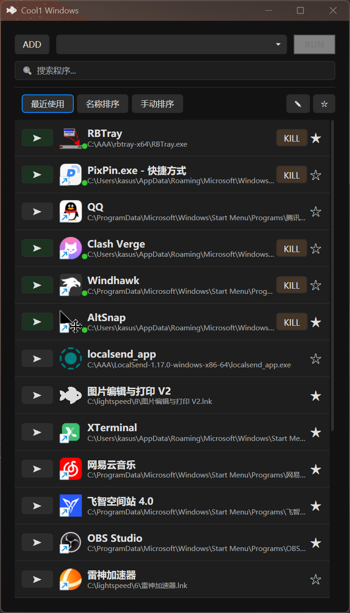

# Cool1 Windows
这是一个应用程序、文件快速启动器，使用dotnet开发。
我的另一个程序：https://github.com/cornradio/cool1 的 windwos版本。

## 功能
- 程序快速启动和杀掉
- 程序管理和收藏
- 打开程序所在目录、在终端运行（时候命令行程序）
- 其实不只是程序，也可也放文件夹、文档、图片等。这就是个临时窗口你想放啥他都支持！

## 下载
在[publish](https://github.com/cornradio/cool1-windows/blob/master/cool1-windows/publish/Cool1Windows.exe)文件夹。

## 帖子
[cool1-windows 小众论坛帖子](https://meta.appinn.net/t/topic/79364)
## 图片

配合[DWMBlurGlass](https://github.com/Maplespe/DWMBlurGlass)（标题栏透明）使用效果更好哦。

## 更新日志

### beta
- 2026-01-08
  - 增加了搜索程序名称的功能（以及中文首字母搜索）
  - 增加了版本信息、github链接
  - 增加了搜索支持中文首字母（拼音缩写）匹配的功能
  - [修复] Cool1Windows.Models.AppInfo bug 
  - [修复] 现在开始他会记住你选择过的排序方式
- 2026-01-05
  - 增加了记忆窗口大小的功能
- 2025-12-27
  - 修复了按照名字排序和手动排序问题
  - 增加了拖动排序的功能(仅手动排序可用)
  - 更新了图标
